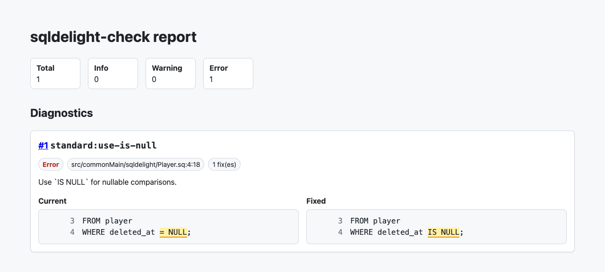

# sqldelight-check

[](https://github.com/sya-ri/sqldelight-check/actions/workflows/ci.yml)
[](https://central.sonatype.com/artifact/dev.s7a/sqldelight-check-api)
[](https://plugins.gradle.org/plugin/dev.s7a.sqldelight.check)

SQLDelight formatter and rule-based linter for `.sq` and `.sqm` files.

sqldelight-check is a Gradle plugin for projects that already use SQLDelight. It reads SQLDelight's Gradle model,
resolves database source files and dialect metadata, then runs sqldelight-check rule sets over those files.

## Status

sqldelight-check is pre-release. The latest release is `v0.2.2`.

The initial release focuses on Gradle plugin usage. There is no standalone CLI.

## Install

Apply the sqldelight-check Gradle plugin to the Gradle project that already applies SQLDelight:

```kotlin
plugins {
    id("dev.s7a.sqldelight.check") version "0.2.2"
}
```

No sqldelight-check dependencies are required for the default setup. The plugin installs the standard rule set, official
dialect rule sets, and standard reporters by default. Dialect-specific rules stay inactive under `Auto` unless a
database exposes the matching SQLDelight dialect capability.

## Run

Use the Gradle tasks installed by the plugin:

```shell
./gradlew sqldelightCheck
./gradlew sqldelightFix
```

- `sqldelightCheck`: run rules and reports without modifying files.
- `sqldelightFix`: apply allowed fixes, re-run rules, then write reports.

The first rules are lint-style rules with safe fixes. Formatting rules can use the same check/fix task model when they
are added.

## Configure

Configure rule sets, rules, reports, fix safety, and database-specific overrides in `build.gradle.kts`:

```kotlin
import dev.s7a.sqldelight.check.api.LogLevel
import dev.s7a.sqldelight.check.api.Severity

sqldelightCheck {
    ruleSets {
        postgres {
            enabled.set(false)
        }
    }

    rules {
        rule("standard:final-newline") {
            enabled.set(true)
            severity.set(Severity.Warning)
        }
        rule("standard:no-trailing-whitespace") {
            severity.set(Severity.Error)
        }
        rule("standard:max-line-length") {
            options.put("max", "120")
        }
        rule("standard:max-joins") {
            options.put("max", "8")
        }
        rule("standard:max-subquery-depth") {
            options.put("maxDepth", "3")
        }
        rule("standard:max-case-depth") {
            options.put("maxDepth", "2")
        }
    }

    databases {
        database("Database") {
            rules {
                rule("standard:no-trailing-whitespace") {
                    severity.set(Severity.Warning)
                }
            }
        }
    }

    reports {
        json {
            required.set(true)
            outputFile.set(layout.buildDirectory.file("reports/sqldelight-check/report.json"))
            prettyPrint.set(true)
        }
        sarif {
            required.set(true)
        }
        text {
            required.set(true)
        }
        html {
            required.set(false)
            outputDirectory.set(layout.buildDirectory.dir("reports/sqldelight-check/html"))
        }
        markdown {
            required.set(false)
        }
    }

    fix {
        unsafe.set(false)
    }

    logLevel.set(LogLevel.Verbose)
}
```

Enabled values:

- unset: let sqldelight-check decide from the rule default and applicability.
- `true`: run the rule or rule set.
- `false`: do not run the rule or rule set.

Rule-level explicit enablement overrides a rule set default. Severity values are `Info`, `Warning`, and `Error`; error
diagnostics fail check tasks after reports are written.

Log levels control task output detail:

- `Info`: task summary only.
- `Verbose`: summary plus resolved file inventory.
- `Debug`: summary, resolved file inventory, and per-file rule traces.

You can override the configured level temporarily from the command line:

```shell
./gradlew -PsqldelightCheck.logLevel=debug sqldelightCheck
```

## Disable Diagnostics

Use SQL comments when a source file needs a local rule suppression:

```sql
-- sqldelight-check-disable-next-line standard:use-is-null -- legacy nullable marker
selectById:
SELECT *
FROM player
WHERE deleted_at = NULL;

-- sqldelight-check-disable standard:no-select-star -- legacy export shape
selectEverything:
SELECT *
FROM player;
-- sqldelight-check-enable standard:no-select-star
```

Supported directives:

- `-- sqldelight-check-disable-next-line [rule-id,...]`: suppress matching rule diagnostics on the next line.
- `-- sqldelight-check-disable-file [rule-id,...]`: suppress matching rule diagnostics for the whole file.
- `-- sqldelight-check-disable [rule-id,...]`: start suppressing matching rule diagnostics.
- `-- sqldelight-check-enable [rule-id,...]`: stop the matching `disable` block. Without rule IDs, all active disables stop.

Omitting rule IDs suppresses all rule diagnostics covered by that directive.

When `core:require-suppression-reason` is enabled, put the reason in the same SQL line comment after a second
`--`. The reason belongs on the `disable-file`, `disable-next-line`, or `disable` directive line, not on the suppressed
SQL statement or the later `enable` line.

Unused disable directives are reported as `core:no-redundant-suppression`. This core diagnostic is emitted after
sqldelight-check applies suppressions, so it can identify directives that did not suppress any rule diagnostics.

See [Core diagnostics](core/README.md) for core diagnostic behavior and configuration.

## Rule Sets

Built-in rule set artifacts are installed with the Gradle plugin and are also published separately for custom setups:

The built-in rule sets currently include 154 rules:

- `sqldelight-check-rules-standard`: 125 dialect-independent rules for `.sq` and `.sqm` files.
- `sqldelight-check-rules-postgres`: 12 PostgreSQL-specific rules gated by `DialectCapability.PostgreSql`.
- `sqldelight-check-rules-mysql`: 8 MySQL-specific rules gated by `DialectCapability.MySql`.
- `sqldelight-check-rules-sqlite`: 6 SQLite-specific rules gated by `DialectCapability.SQLite`.
- `sqldelight-check-rules-hsql`: 3 HSQL-specific rules gated by `DialectCapability.Hsql`.

See the rule-set README files for rule behavior, options, and examples:

- [Core diagnostics](core/README.md)
- [Standard rules](rules/standard/README.md)
- [PostgreSQL rules](rules/postgres/README.md)
- [MySQL rules](rules/mysql/README.md)
- [SQLite rules](rules/sqlite/README.md)
- [HSQL rules](rules/hsql/README.md)

Rules run over source files resolved from SQLDelight's Gradle task model. SQLDelight parser and dialect behavior are
not reimplemented by sqldelight-check.

sqldelight-check's standard rules are inspired by the practical SQL linting vocabulary established by
[SQLFluff](https://sqlfluff.com/). Thanks to the SQLFluff project for making those rule categories familiar and useful
to SQL users. sqldelight-check keeps separate rule IDs and behavior because it runs inside SQLDelight projects and uses
SQLDelight database metadata.

## Reports

Built-in reporters are installed with the Gradle plugin:

| Reporter | Default | Output |
| --- | --- | --- |
| `json` | Enabled | Machine-readable summary and diagnostics. |
| `sarif` | Enabled | SARIF 2.1.0 results for code scanning and artifact upload. |
| `text` | Enabled | Compact human-readable diagnostic count. |
| `html` | Disabled | Navigable diagnostics table for uploaded CI artifacts. |
| `markdown` | Disabled | Summary and diagnostics table for GitHub Actions job summaries. |
| `github-annotations` | Auto on GitHub Actions | Workflow command annotations for changed files and check logs. |

Default report outputs are written under `build/reports/sqldelight-check/`. JSON, SARIF, and text are enabled by
default. HTML and Markdown are available but disabled by default. GitHub annotations are enabled automatically on GitHub
Actions when `GITHUB_ACTIONS=true`, unless explicitly disabled.

Reporter-specific options can be set with `options`; the built-in JSON and SARIF reporters also expose typed
`prettyPrint` configuration.

```kotlin
sqldelightCheck {
    reports {
        json {
            prettyPrint.set(true)
        }
        sarif {
            prettyPrint.set(true)
        }
        html {
            required.set(true)
        }
    }
}
```



To publish GitHub annotations, print the generated workflow command file after `sqldelightCheck`, including on failure:

```yaml
- name: Run sqldelight-check
  id: sqldelight-check
  run: ./gradlew sqldelightCheck

- name: Publish sqldelight-check annotations
  if: always()
  run: |
    if [ -f build/reports/sqldelight-check/report.github-annotations ]; then
      cat build/reports/sqldelight-check/report.github-annotations
    fi
```

Upload `build/reports/sqldelight-check/` as a CI artifact when JSON, SARIF, Markdown, or HTML reports are useful to
reviewers. SARIF and GitHub annotation paths are written relative to `GITHUB_WORKSPACE` on GitHub Actions. Outside
GitHub Actions, paths are relative to the Gradle root project. If the Gradle root is nested under the repository
checkout, pass `-PsqldelightCheck.reportRoot="$PWD"` from the checkout root.

## Fix Safety

Fix tasks apply the first allowed fix from each diagnostic. Safe fixes are enabled by default. Unsafe fixes require:

```kotlin
sqldelightCheck {
    fix {
        unsafe.set(true)
    }
}
```

Invalid edits and overlapping edits are skipped. When a fix task changes files, sqldelight-check runs rules again and
writes reports for the remaining diagnostics.

## Custom Extensions

Add custom rule set, reporter, and dialect artifacts through Gradle configurations:

```kotlin
dependencies {
    sqldelightCheckRuleSet("com.example:my-sqldelight-rules:1.0.0")
    sqldelightCheckReporter("com.example:my-sqldelight-reporter:1.0.0")
    sqldelightCheckDialects("com.example:my-sqldelight-dialects:1.0.0")
}
```

Authoring guides:

- [Rule Set Author Guide](docs/rule-set-authors.md)
- [Reporter Author Guide](docs/reporter-authors.md)
- [Dialects Author Guide](docs/dialects-authors.md)

Rule sets can also refine diagnostics emitted by other rule sets. Dialect rule sets use this to suppress false positives
when a general rule sees dialect-specific syntax that only that dialect should interpret.

## SQLDelight And Dialects

sqldelight-check reads SQLDelight database tasks from Gradle and supports multiple SQLDelight databases in one project.
Dialect metadata is inferred from SQLDelight's dialect configuration and passed to rules as stable sqldelight-check API
data. The core rule engine does not invoke the SQLDelight compiler, so SQLDelight version compatibility is primarily
bounded by the Gradle task model used to discover databases and source folders.

## Limitations

- There is no standalone CLI.
- sqldelight-check reports rule diagnostics only; it does not replace SQLDelight parser or compiler diagnostics.
